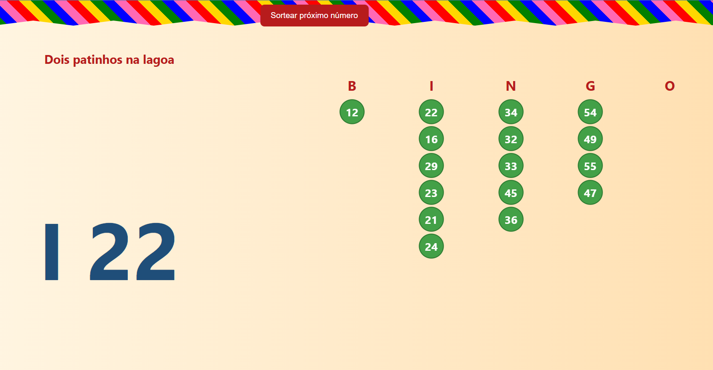

# 🎉 Bingo Junino 🎯

**"Olha o bug! É mentiraaa..."** – Um bingo temático de Festa Junina, feito para animar as comemorações da família e, de quebra, ensinar os conceitos básicos de **HTML**, **CSS** e **JavaScript** para novos desenvolvedores.

---

## 🌽 Sobre o projeto

Todo ano, na festa junina da família, rola aquele bingo animado!  
Este projetinho nasceu para modernizar a tradição: agora o sorteio é **100% digital**, mas sem perder o charme das bandeirinhas e das frases engraçadas.

Além da diversão, o objetivo é **mostrar na prática como HTML, CSS e JS trabalham juntos** para criar uma aplicação web simples e interativa.

---

## 🛠️ Tecnologias usadas

- **HTML5** – Estrutura da página
- **CSS3** – Estilo junino com bandeirinhas e cores vibrantes
- **JavaScript** – Sorteio dos números e interação com a interface
- **jQuery** – Manipulação facilitada do DOM

---

## 🎯 Funcionalidades

✅ Sorteia números de **1 a 75** seguindo o formato tradicional de bingo (B, I, N, G, O)  
✅ Mostra frases divertidas para números especiais (ex.: "Dois patinhos na lagoa")  
✅ Lista de números sorteados, organizada por coluna  
✅ Efeitos visuais para deixar a experiência mais animada

---

## 📚 Objetivo educacional

Este projeto é parte de um **mapa de carreiras para desenvolvedores iniciantes**, e foi pensado para ensinar:

- 📄 Estruturação de conteúdo com HTML
- 🎨 Estilização e animações simples com CSS
- ⚙️ Lógica de programação e manipulação de elementos com JavaScript
- 📦 Organização de arquivos em um pequeno projeto web

---

## 🎮 Como jogar

1. Abra o arquivo `index.html` no seu navegador
2. Clique no botão **"Sortear próximo número"**
3. Anote o número na sua cartela (ou invente as regras 😄)
4. Continue até alguém gritar **BINGO!**

---

## 🖼️ Preview

  
*Exemplo de como fica a interface com bandeirinhas e colunas de números.*

---

## 💡 Ideias para evoluir

- Adicionar som de festa junina a cada número sorteado
- Criar modo **cartela virtual** para os jogadores
- Adicionar contador regressivo entre sorteios

---

## 📜 Licença

Este projeto é de uso livre para fins de estudo e diversão.  
Se usar, lembre de manter a tradição: **não vale roubar no bingo!** 🎯

---

> _"Tecnologia também pode ser divertida. E se tiver pipoca e quentão, melhor ainda!"_
